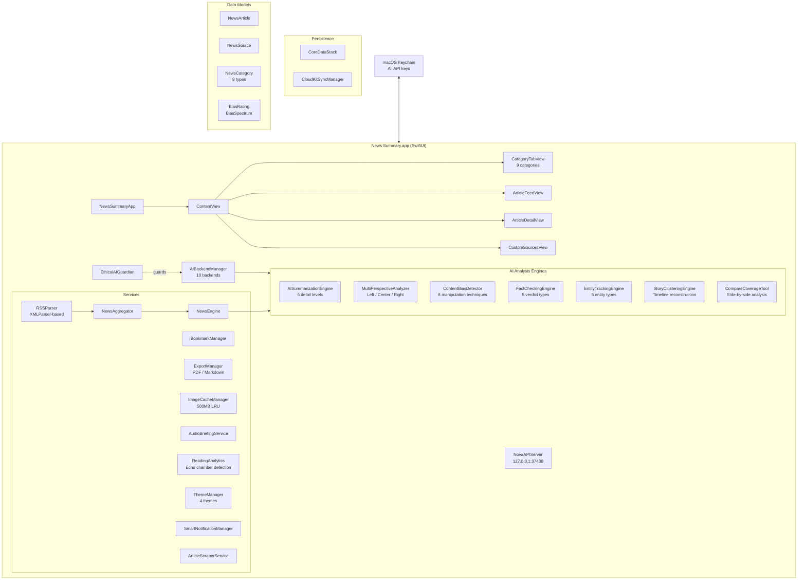

# News Summary


**AI-powered news aggregator with multi-perspective analysis, real-time fact checking, content-level bias detection, and ethical AI safeguards.**

Written by Jordan Koch ([@kochj23](https://github.com/kochj23)).

---

## Architecture


```mermaid
graph TD
    subgraph App["News Summary.app (SwiftUI)"]
        Entry[NewsSummaryApp] --> Content[ContentView]
        Content --> Categories[CategoryTabView\n9 categories]
        Content --> Feed[ArticleFeedView]
        Content --> Detail[ArticleDetailView]
        Content --> Sources[CustomSourcesView]

        subgraph AIEngines["AI Analysis Engines"]
            Summarize[AISummarizationEngine\n6 detail levels]
            MultiPersp[MultiPerspectiveAnalyzer\nLeft / Center / Right]
            Bias[ContentBiasDetector\n8 manipulation techniques]
            FactCheck[FactCheckingEngine\n5 verdict types]
            Entity[EntityTrackingEngine\n5 entity types]
            Cluster[StoryClusteringEngine\nTimeline reconstruction]
            Compare[CompareCoverageTool\nSide-by-side analysis]
        end

        subgraph Services["Services"]
            RSS[RSSParser\nXMLParser-based]
            Aggregator[NewsAggregator]
            Engine[NewsEngine]
            Bookmark[BookmarkManager]
            Export[ExportManager\nPDF / Markdown]
            ImageCache[ImageCacheManager\n500MB LRU]
            Audio[AudioBriefingService]
            Analytics[ReadingAnalytics\nEcho chamber detection]
            Theme[ThemeManager\n4 themes]
            Notify[SmartNotificationManager]
            Scraper[ArticleScraperService]
        end

        AIBackend[AIBackendManager\n10 backends] --> AIEngines
        Guardian[EthicalAIGuardian] -.->|guards| AIBackend
        RSS --> Aggregator --> Engine
        Engine --> AIEngines

        API[NovaAPIServer\n127.0.0.1:37438]
    end

    subgraph Data["Persistence"]
        CoreData[CoreDataStack]
        CloudKit[CloudKitSyncManager]
    end

    subgraph Models["Data Models"]
        Article[NewsArticle]
        Source[NewsSource]
        Category[NewsCategory\n9 types]
        BiasModel[BiasRating\nBiasSpectrum]
    end

    Keychain[macOS Keychain\nAll API keys] <--> App
```

---

## Features

### Multi-Perspective Analysis

Shows the same story from Left, Center, and Right perspectives side-by-side. Identifies shared facts, points of contention, and frame analysis showing how language differs across viewpoints. Exportable comparison reports in PDF and Markdown.

### AI Summarization (6 Levels)

| Level | Description |
|---|---|
| Headline | 10-15 words |
| Brief | 2-3 sentences |
| Standard | 1 paragraph |
| Detailed | 3-5 paragraphs |
| ELI5 | Simple language explanation |
| Technical | Expert-level with domain knowledge |

### Content-Level Bias Detection

AI analyzes article text (not just source reputation): 8 manipulation techniques detected, loaded language highlighting, omission bias identification, frame control analysis, objectivity score (0-100).

### Real-Time Fact Checking

5 verdict types: True, False, Misleading, Partially True, Unverifiable. Confidence scores (0-100%), evidence and sources provided, cross-article consensus.

### Entity Tracking

Automatic extraction of 5 entity types (people, organizations, locations, events, topics). Sentiment analysis per entity, relationship graphs, entity timelines.

### Story Clustering and Timelines

Automatically groups related articles into chronological timelines. Tracks story evolution with significance levels (Major / Update / Minor).

### Coverage Comparison Tool

Professional side-by-side analysis: tone comparison (Alarmist / Measured / etc.), key points from each perspective, shared facts versus contentions.

### Reading Analytics

Reading habits tracking with echo chamber detection. Bias exposure metrics with weekly/monthly reports. Warns when reading patterns become one-sided.

### News Sources and RSS

Built-in source database with credibility ratings across 9 categories: US, World, Business, Technology, Science, Health, Entertainment, Sports, Opinion. Custom RSS source management. Article scraping for full-text extraction.

### Audio Briefings

Professional narration via cloud AI (AWS Polly, Google, Azure voices). Chapter markers and background playback.

### Export

PDF and Markdown export for single articles or collections. Includes all AI analysis, metadata, and formatting.

### Smart Notifications

Priority-based breaking news alerts with Do Not Disturb hours, category filtering, and daily digest option.

### Themes

4 themes: Light, Dark, OLED Black (true black), and System (auto-match).

### Image Caching

500 MB LRU cache with memory + disk layers for instant loading.

### Local API Server

Port **37438**, loopback only. `GET /api/status` and `GET /api/ping`.

---

## AI Backends

| Backend | Type | Notes |
|---|---|---|
| Ollama | Local | Preferred default, GPU-accelerated |
| MLX | Local | Apple Silicon optimized |
| TinyLLM | Local | Lightweight OpenAI-compatible |
| TinyChat | Local | Fast chatbot interface |
| OpenWebUI | Local | Self-hosted platform |
| OpenAI | Cloud | GPT-4o |
| Google Cloud | Cloud | Vertex AI |
| Azure | Cloud | Cognitive Services |
| AWS | Cloud | Bedrock, Polly |
| IBM Watson | Cloud | NLU, Discovery |

Auto-fallback: if primary backend fails, automatically tries next available. All API keys stored in macOS Keychain (migrated from UserDefaults in v1.1.0).

---

## Ethical AI Safeguards

All AI interactions pass through the EthicalAIGuardian: 100+ prohibited pattern detection, automatic blocking of harmful content, crisis resource referrals (988 Suicide Prevention, Crisis Text Line, Domestic Violence Hotline, SAMHSA), hashed violation logging.

---

## Installation

Distributed as a DMG installer. Not available on the Mac App Store.

```bash
# From DMG (recommended)
# Download from https://github.com/kochj23/NewsSummary/releases
# Drag News Summary.app to Applications

# From source
cd "/Volumes/Data/xcode/News Summary"
xcodebuild -scheme "News Summary" -configuration Release build
```

### Requirements

- macOS 14.0 (Sonoma) or later
- Xcode 15.0+ (building from source)
- Internet connection (for RSS feeds; cloud AI optional)

### AI Backend Quick Start

```bash
brew install ollama && ollama serve && ollama pull mistral:latest
```

---

## Keyboard Shortcuts

| Shortcut | Action |
|---|---|
| Cmd+K | Search |
| Cmd+B | Bookmark |
| Cmd+R | Refresh feeds |

---

## Testing

116 tests in a single comprehensive XCTest file covering unit, functional, and security tests.

| Category | Tests | Coverage |
|---|---|---|
| NewsArticle Model | 12 | Creation, equality, hashing, Codable, title similarity, recency |
| NewsCategory | 4 | All cases, display names, icons, Codable |
| BiasSpectrum | 7 | Values, ordering, symmetry, from-value mapping, short labels |
| BiasRating | 4 | Confidence levels, labels, Codable |
| NewsSource | 8 | Database coverage, category filtering, URLs, credibility |
| RSS Parser | 9 | XML parsing, date formats, HTML stripping, malformed input |
| ReadingTime | 8 | Word count, time estimation, formatting, difficulty |
| EthicalGuardian | 3 | Enabled state, guidelines content, statistics |
| Security | 6 | No hardcoded API keys, XSS sanitization, URL validation, HTTPS |
| Additional | 55 | Comprehensive model, service, and integration coverage |

```bash
xcodebuild test -scheme "News Summary" -sdk macosx -destination "platform=macOS"
```

---

## Version History

| Version | Date | Highlights |
|---|---|---|
| 1.1.0 | Mar 2026 | API keys migrated to macOS Keychain with automatic UserDefaults migration |
| 1.0.0 | Feb 2026 | Initial release: multi-perspective analysis, fact checking, bias detection, CloudKit sync |

---

## License

MIT License -- see [LICENSE](./LICENSE).

Copyright (c) 2026 Jordan Koch. All rights reserved.

---

Written by Jordan Koch ([@kochj23](https://github.com/kochj23)).

> Disclaimer: This is a personal project created on my own time. It is not affiliated with, endorsed by, or representative of my employer.
